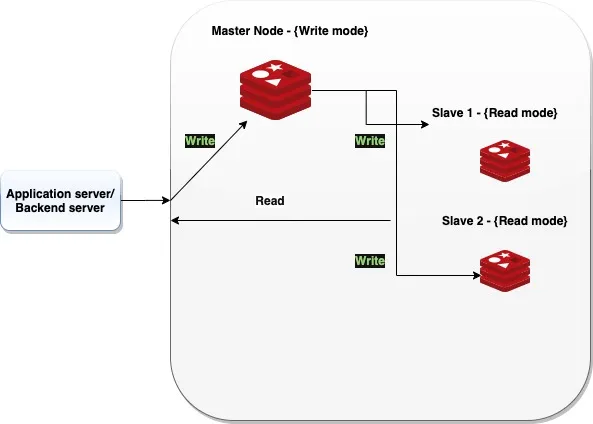
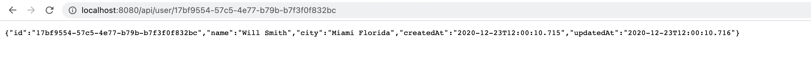

# Architecture maitre esclave avec Redis & Spring-boot


Dans cette architecture, nous avons:

* **Une application spring boot**
* **Une base Master**: Cette base master est accessible en écriture.
* **Deux bases esclaves**: Les deux bases esclaves sont accessibles en lecture. Elles permettrons d'assurer la disponibilité des informations en cas d'indisponibilité de la base Master

Avant de démarer notre application , nous devons lancer nos différentes bases redis avec docker.
```
docker-compose up 
```
Une fois les bases redis démarées, nous démarons notre application spring-boot.Cette application expose deux web-services.

- PUT localhost:8082/api/user
- PUT localhost:8082/api/user/{id}

Le premier webservice permet d'enregistrer des informations dans la base de données qui est aussi tôt repliquées vers deux bases esclaves.
Le deuxième permet de recupérer les informations enregistrées.

Une fois quelques informations enregistrées, essayons d'éteindre notre master avec
```
docker-compose stop master
```
Essayons de récupérer l'un des utilisateurs avec l'API GET en passant un identifiant d'utilisateur valide.


Vous voyez que vous pouvez toujours obtenir les données si le nœud maître est hors service et que l'objectif des nœuds esclaves est la lecture seule. Les données peuvent être lues correctement.

Mais les écritures seront bloquées car, rappelons-le, les nœuds esclaves sont des nœuds en lecture seule.

> io.lettuce.core.RedisException: Master is currently unknown: [RedisUpstreamReplicaNode [redisURI=redis://127.0.0.1:7001, role=REPLICA], RedisUpstreamReplicaNode [redisURI=redis://127.0.0.1:7000, role=REPLICA]]


Pour d'autres informations, je vous invite à consulter ce lien
* [Redis Master Slave Configuration](https://eresh-zealous.medium.com/redis-master-slave-configuration-and-tested-in-spring-boot-3a68e7314b90)
